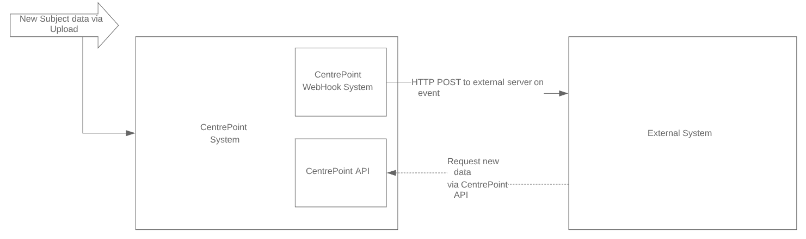

# CentrePoint System Integration Guide

## Overview
This document contains an overview of the system integration options with ActiGraph’s [CentrePoint](https://actigraphcorp.com/centrepoint/) System

## CentrePoint Webhook System
An available option to have data *flowing* from the CentrePoint System into an Electronic Data Capture (EDC) (or other external) system is to utilize the [CentrePoint Webhook System](https://github.com/actigraph/CentrePointWebhookDocumentation). 

Webhooks allow you to build or set up integrations which subscribe to certain events on ActiGraph's CentrePoint ecosystem. When one of those events is triggered, CentrePoint will send a HTTP POST payload to the webhook's configured URL. 

With the Webhook architecture, CentrePoint will PUSH webhook events to clients containing specific metadata on the event which allow clients to then PULL in the related data. EDCs (and other clients) can utilze the CentrePoint APIs to retrieve (or PULL) new subject data as it becomes available (or is processed). 

Refer to the diagram below:

## CentrePoint *PUSH* Service Architecture 
To faciliate future integrations between CentrePoint and external systems, ActiGraph will be supportting a *PUSH* service architecture in the near future. Here ActiGraph's software engineering team will likely design a means to *PUSH* RAW/EPOCH data files to a study-configured logical cloud container (i.e. Azure storage account, AWS bucket, and/or sFTP server path). In addition to RAW/EPOCH data files, ActiGraph intends to support the *Pushing* of analytics related data through calculated subject daily aggregates/statistics.

## CentrePoint V3 API

ActiGraph's has recently lauched the [CentrePoint V3 API](https://github.com/actigraph/CentrePoint3APIDocumentation) which provides additional flexibility to retrieve RAW sub-second resolution data. The CentrePoint V3 API uses the OAuth 2.0 framework for it's authorization flow.

The [CentrePoint V3 API](https://github.com/actigraph/CentrePoint3APIDocumentation) provides API endpoints for clients to retrieve RAW sub-second resolution actigraphy data between given time ranges which can be easily consumed and serialized. To view the supported formats/data definitions for retrieving RAW data in the CentrePoint V3 API, view [RAW Data File Formats]( https://github.com/actigraph/CentrePoint3APIDocumentation/blob/master/sections/raw_data_file_formats.md).

#### CentrePoint V3 API cababilities (as of today)

The [CentrePoint V3 API](https://github.com/actigraph/CentrePoint3APIDocumentation) supports the following operations:

+ Retrieve RAW sub-second subject data (between time ranges)
+ Retrieve Epoch summary records with a variable summary length (i.e. 15-sec, 30-sec, 60-sec epoch length)
+ Adding/Editing Subjects
+ Assigning/Deploying ActiGraph Monitor to subject
+ Un-assigning ActiGraph Monitor from subject
+ Retrieve general information on subjects & study/site configurations

#### CentrePoint V3 API (future cababilities)

The [CentrePoint V3 API](https://github.com/actigraph/CentrePoint3APIDocumentation) will support the following operations in the future:

+ Retrieve subject analytics data (i.e. sleep periods, wear periods, daily statistics, steps, cut points, etc.)

## CentrePoint V2 API

ActiGraph continues to support the [CentrePoint V2 API](https://github.com/actigraph/StudyAdminAPIDocumentation). This API is based on a different authentication mechanism that the CentrePoint V3 API and therefore requires a different set of credentials.

The CentrePoint V2 API currently supports the following operations:

+ Retrieve subject epoch summary data  (limited to 60-sec/minute epoch length)
+ Retrieve subject RAW sub-second data (limited to GT3X format, limited to single data range based on uploads, limited to epoch-based studies, RAW data retrieval for CPW01 Insight Watch not supported in CP V2 API)
+ Retrieve subject analytics data (i.e. sleep periods, wear periods, daily statistics, steps, cut points, etc.)
+ Adding/Editing Subjects
+ Assigning/Deploying ActiGraph Monitor to subject
+ Un-assigning ActiGraph Monitor from subject
+ Retrieve general information on subjects & study/site configurations

